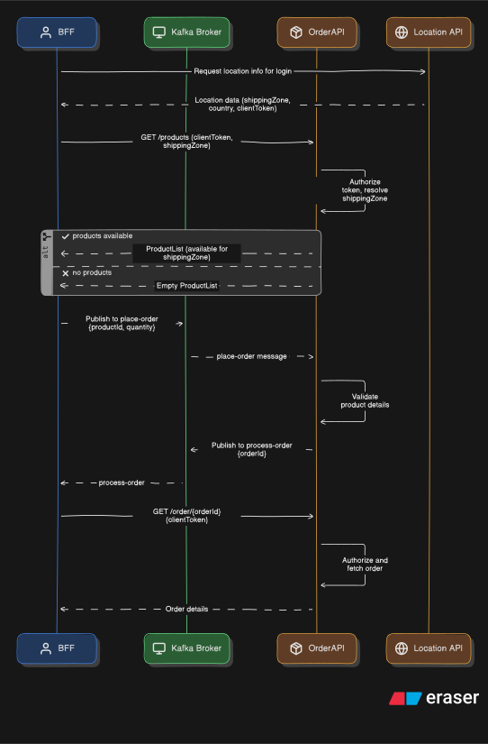

# 🚀 Specmatic Arazzo Async Demo

[Specmatic Arazzo](https://hub.docker.com/extensions/specmatic/specmatic-docker-desktop-extension) is a **NO-CODE** workflow mocking and testing tool that allows users to efficiently **author**, **validate**, **test**, and **mock** workflows, leveraging [Arazzo API Specifications](https://spec.openapis.org/arazzo/latest.html)
This repository serves as a hands-on companion to the video demonstration below,
We recommend setting up the project locally and following along with the video tutorial to get the full interactive experience of working with Specmatic Arazzo

## 🎬 Video Walkthrough

[](https://youtu.be/fXWzgqLdWcg)

## 📋 Prerequisites

- [Docker Desktop](https://www.docker.com/products/docker-desktop/)
- [Specmatic Docker Extension](https://hub.docker.com/extensions/specmatic/specmatic-docker-desktop-extension)

## 🔧 Setup

### Clone the Specmatic Arazzo Async Sample repository:
```shell
git clone https://github.com/specmatic/specmatic-arazzo-async-sample
cd specmatic-arazzo-async-sample
```

## Running the Project

To launch the stack, execute the following command to build and start the containers:

```shell
docker compose up --build
```

This builds and starts:
- [Order API](./order_api) at http://localhost:3000
- [Location API](./location_api) at http://localhost:3001
- [Kafka](https://kafka.apache.org) at localhost:9092

### Launch the Extension:
Launch the [Specmatic Docker Extension](https://hub.docker.com/extensions/specmatic/specmatic-docker-desktop-extension), populate the `directory` field with the path to the [`specmatic-arazzo-async-sample`](./) directory, as illustrated in the image below and hit `Launch`


## What This Demo Shows

- **Author**, **validate**, **test**, and **mock** [**OpenAPI**](https://www.openapis.org/) and [**AsyncAPI**](https://www.asyncapi.com/) workflow with Specmatic Arazzo, without single line of code.
- Model workflows using [**Arazzo API Specifications**](https://spec.openapis.org/arazzo/latest.html) and run them via [**Specmatic Studio’s**]((https://hub.docker.com/extensions/specmatic/specmatic-docker-desktop-extension)) drag‑and‑drop UI.
- Test two microservices [**Order API**](./order_api), [**Location API**](./location_api) and exercise async messaging via [**Arazzo**](https://spec.openapis.org/arazzo/latest) with AsyncAPI over Kafka end‑to‑end.

## 🏗️ Application Architecture

This project includes below services:
- Backend Services (developed using **FastAPI**, **SQLModel**, and **SQLite**)
  - [**Order API**](./order_api)
  - [**Location API**](./location_api)
- [**Kafka Broker**](https://kafka.apache.org/)

## 📝 Flow



### Input for workflow testing

```json
{
    "PlaceOrder": {
        "DEFAULT": {
            "CreateOrder": {
                "orderRequestId": "1234567890"
            },
            "GetUserDetails": {
                "email": "test@specmatic.io",
                "password": "specmatic",
                "internalToken": "API-TOKEN"
            }
        },
        "GetProducts.IsArrayEmpty": {
            "$failureMessage": "Expected not to find any products for random@specmatic.io, as they belong to B Zone",
            "GetUserDetails": {
                "email": "random@specmatic.io",
                "password": "user"
            }
        }
    }
}
```
